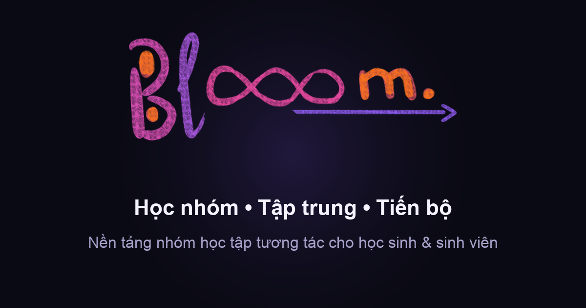

<div align="center">


# Blooom

**Nền tảng nhóm học tập tương tác cho học sinh &amp; sinh viên**

Kết nối nhóm học theo môn · Tập trung với Pomodoro · Theo dõi hiệu suất · Số hóa ghi chú

[](https://github.com/gmtigrisva123/Blooom-Project/actions/workflows/ci.yml)
[](https://github.com/gmtigrisva123/Blooom-Project/actions/workflows/deploy.yml)
[](LICENSE)
[](https://react.dev)
[](https://vite.dev)

[**🌐 Xem demo trực tiếp**](https://blooom-project.vercel.app/) · [Báo lỗi](https://github.com/gmtigrisva123/Blooom-Project/issues/new?template=bug_report.yml) · [Đề xuất tính năng](https://github.com/gmtigrisva123/Blooom-Project/issues/new?template=feature_request.yml)



</div>

---

## Giới thiệu

Blooom gom bốn thứ một học sinh thường phải dùng bốn ứng dụng khác nhau vào một chỗ: tìm
nhóm học cùng môn, đồng hồ Pomodoro để tập trung, bảng theo dõi tiến độ, và kho ghi chú.
Trên nền dữ liệu đó, ứng dụng chạy bốn mô hình khoa học thật: lịch ôn ngắt quãng SM-2,
đường cong quên Ebbinghaus, thí nghiệm N-of-1 có phân bổ ngẫu nhiên, và phân tích cosinor
nhịp sinh học.

Mỗi phút học được ghi lại thành **điểm XP**, đủ XP thì lên cấp, học đều đặn thì giữ được
**chuỗi ngày liên tiếp**, và có **14 huy hiệu** để mở khóa dần.

### Nguyên tắc về dữ liệu

Ứng dụng **không có bất kỳ dữ liệu mẫu, dữ liệu mô phỏng hay dữ liệu minh họa nào**. Một
tài khoản mới nhìn thấy màn hình trống kèm hướng dẫn tạo dữ liệu đầu tiên, và mọi con số
hiển thị đều tính từ hành vi có thật của chính người dùng đó.

Ba hệ quả được cưỡng chế trong mã nguồn:

- Tệp migration `supabase/migrations/0001_init.sql` không chứa một câu `INSERT` dữ liệu nào.
- Khi thiếu cấu hình cơ sở dữ liệu, ứng dụng **từ chối chạy** thay vì âm thầm lưu tạm trong
  trình duyệt — để không bao giờ có chuyện giao diện hoạt động bình thường trong khi dữ
  liệu thật ra không được lưu.
- Số liệu dẫn xuất (chuỗi ngày, XP, huy hiệu, đường cong quên) **không bao giờ được lưu**;
  chúng luôn được tính lại từ dữ liệu thô, nên không thể mâu thuẫn với dữ liệu gốc.

Toàn bộ dữ liệu thô — kể cả từng lần chấm thẻ ghi nhớ và từng phiên thí nghiệm — xuất ra
JSON bằng nút tải trong thanh bên, để kết quả phân tích kiểm chứng lại được bằng công cụ
bên ngoài.

## Tính năng

| Khu vực                 | Nội dung                                                                                                                     |
| ----------------------- | ---------------------------------------------------------------------------------------------------------------------------- |
| 📊 **Tổng Quan**        | Lời chào theo buổi, chuỗi ngày học, thanh XP, biểu đồ 7 ngày, dòng hoạt động gần đây, bộ sưu tập huy hiệu                    |
| 👥 **Nhóm Học Tập**     | Tạo và tham gia nhóm, lọc theo 7 môn, tìm kiếm, nhóm công khai / riêng tư                                                    |
| ⏱️ **Bộ Đếm Giờ**       | Pomodoro với vòng đếm SVG, 3 cấu hình dựng sẵn (25/50/90 phút), âm báo Web Audio, tự chuyển sang giờ nghỉ, nhật ký phiên học |
| ✨ **Editor's Pick**    | Bài viết mẹo học tập, lưu bài yêu thích, đăng bài mới ở vai trò Admin                                                        |
| 📈 **Hiệu Suất**        | Vòng đo mục tiêu tuần, lịch nhiệt 7 ngày, phân phối thời gian theo môn, đặt mục tiêu                                         |
| 📁 **Ghi Chú**          | Tải ảnh chụp vở hoặc PDF lên Supabase Storage, phân loại theo môn, gắn vào nhóm học, xem và tải về                           |
| 🧠 **Ôn Tập**           | Thẻ ghi nhớ lên lịch bằng SM-2, đường cong quên Ebbinghaus, dự báo số thẻ đến hạn 14 ngày, nhật ký từng lần chấm điểm        |
| 🧪 **Phòng Thí Nghiệm** | Thí nghiệm N-of-1: khai báo giả thuyết trước, phân bổ ngẫu nhiên theo khối, kiểm định Welch kèm Cohen's d và KTC 95%         |
| 🌊 **Nhịp Sinh Học**    | Khớp cosinor 24 giờ tìm giờ đỉnh tập trung, hồi quy OLS dự báo tuần tới kèm khoảng tin cậy                                   |

**Xuyên suốt toàn app:** giao diện sáng/tối, màu nhấn đổi theo từng khu vực, command palette
`Ctrl+K` tìm kiếm không dấu, phím tắt đầy đủ, responsive từ 375px, tôn trọng
`prefers-reduced-motion`.

## Phím tắt

| Phím                          | Chức năng                                              |
| ----------------------------- | ------------------------------------------------------ |
| <kbd>Ctrl</kbd>+<kbd>K</kbd>  | Mở command palette (tìm nhóm, ghi chú, bài viết, lệnh) |
| <kbd>1</kbd>…<kbd>6</kbd>     | Nhảy tới từng khu vực                                  |
| <kbd>Space</kbd>              | Chạy / tạm dừng Pomodoro (khi đang ở tab Bộ Đếm Giờ)   |
| <kbd>R</kbd>                  | Đặt lại bộ đếm                                         |
| <kbd>Shift</kbd>+<kbd>D</kbd> | Đổi giao diện sáng / tối                               |
| <kbd>?</kbd>                  | Mở bảng tra cứu phím tắt                               |
| <kbd>Esc</kbd>                | Đóng hộp thoại đang mở                                 |

Phím tắt tự động vô hiệu khi con trỏ đang ở trong ô nhập liệu.

## Bắt đầu

**Yêu cầu:** Node.js 22.12 trở lên, và một dự án [Supabase](https://supabase.com) (gói miễn
phí là đủ).

```bash
git clone https://github.com/gmtigrisva123/Blooom-Project.git
cd Blooom-Project
npm install
```

### Thiết lập cơ sở dữ liệu

1. Tạo một project mới tại [supabase.com/dashboard](https://supabase.com/dashboard).

2. Mở **SQL Editor**, dán toàn bộ nội dung
   [`supabase/migrations/0001_init.sql`](supabase/migrations/0001_init.sql) rồi bấm **Run**.
   Tệp này tạo bảng, chỉ mục, trigger, chính sách Row Level Security và bucket lưu tệp ghi
   chú. Chạy lại nhiều lần không gây lỗi.

3. _(Tùy chọn)_ Bật **Authentication › Sign In / Providers › Allow anonymous sign-ins** nếu
   muốn giữ nút “Dùng thử không cần tài khoản”.

4. Chép biến môi trường và điền khóa lấy ở **Project Settings › API**:

   ```bash
   cp .env.example .env
   ```

   ```
   VITE_SUPABASE_URL=https://<project-ref>.supabase.co
   VITE_SUPABASE_ANON_KEY=<anon-public-key>
   ```

   > [!WARNING]
   > Chỉ dùng khóa **anon public**. Khóa `service_role` bỏ qua toàn bộ Row Level Security,
   > và mọi biến `VITE_*` đều được nhúng thẳng vào JavaScript gửi tới trình duyệt — đặt nó
   > vào `.env` là công khai quyền quản trị cơ sở dữ liệu cho bất kỳ ai mở DevTools.

5. Chạy ứng dụng:

   ```bash
   npm run dev
   ```

Mở http://localhost:3000. Nếu chưa cấu hình xong, ứng dụng sẽ hiện màn hình hướng dẫn kèm
đúng các bước trên thay vì chạy với dữ liệu tạm.

### Các lệnh có sẵn

| Lệnh               | Tác dụng                                                       |
| ------------------ | -------------------------------------------------------------- |
| `npm run dev`      | Chạy máy chủ phát triển kèm hot reload                         |
| `npm run build`    | Build bản production vào `dist/`                               |
| `npm run preview`  | Xem thử bản đã build                                           |
| `npm run lint`     | Kiểm tra mã bằng ESLint                                        |
| `npm run lint:fix` | Tự sửa những lỗi lint sửa được                                 |
| `npm run format`   | Định dạng toàn bộ mã bằng Prettier                             |
| `npm run verify`   | Chạy cả lint + format:check + build (giống hệt CI)             |
| `npm run assets`   | Tạo lại icon và ảnh Open Graph từ `scripts/generate-assets.py` |

## Cấu trúc dự án

```
supabase/
└── migrations/
    └── 0001_init.sql     Lược đồ đầy đủ: bảng, index, trigger, RLS, storage

src/
├── components/
│   ├── Auth/             Đăng nhập, đăng ký, chế độ khách
│   ├── CommandPalette/   Ctrl+K palette và bảng phím tắt
│   ├── Dashboard/        Trang tổng quan
│   ├── EditorPick/       Bài viết mẹo học tập
│   ├── Groups/           Nhóm học tập
│   ├── Insights/         Cosinor nhịp sinh học và dự báo
│   ├── Lab/              Thí nghiệm N-of-1
│   ├── Landing/          Trang giới thiệu
│   ├── Layout/           Sidebar và topbar
│   ├── Notes/            Kho ghi chú
│   ├── Performance/      Theo dõi hiệu suất
│   ├── Recall/           Ôn tập ngắt quãng SM-2
│   ├── Setup/            Màn hình hướng dẫn khi chưa cấu hình CSDL
│   ├── Timer/            Pomodoro
│   └── common/           Modal, empty state, thẻ số liệu, skeleton...
├── constants/            Danh sách môn học và cấu hình điều hướng
├── context/              AppContext — trạng thái dùng chung, mọi thao tác ghi async
├── hooks/                Phím tắt toàn cục, chủ đề, đồng hồ chung
├── services/
│   ├── db/
│   │   ├── index.js      Repository cho từng bảng + nạp/xuất toàn bộ dữ liệu
│   │   └── mappers.js    Ánh xạ snake_case (SQL) ↔ camelCase (React)
│   ├── supabase.js       Khởi tạo client, dịch lỗi sang tiếng Việt
│   ├── auth.js           Đăng ký / đăng nhập / nhật ký phiên qua Supabase Auth
│   ├── srs.js            Thuật toán SM-2 và mô hình quên Ebbinghaus
│   ├── experiments.js    Ngẫu nhiên hóa khối và phân tích N-of-1
│   ├── chronobiology.js  Khớp cosinor 24 giờ
│   ├── statistics.js     Welch t-test, hồi quy OLS, thống kê mô tả
│   ├── gamification.js   Streak, XP, cấp độ, huy hiệu (luôn tính lại, không lưu)
│   └── storage.js        Chỉ tùy chọn giao diện theo thiết bị
└── styles/               Design system CSS thuần, tách theo vai trò
```

### Tầng dữ liệu

| Bảng                                | Nội dung                                                                      |
| ----------------------------------- | ----------------------------------------------------------------------------- |
| `profiles`                          | Hồ sơ 1-1 với `auth.users`, kèm `sign_in_count` và `last_sign_in_at`          |
| `auth_events`                       | Nhật ký bất biến mỗi lần đăng ký / đăng nhập / đăng xuất                      |
| `study_groups`                      | Nhóm học; số thành viên là `COUNT` trên `group_members`, không phải cột riêng |
| `group_members`                     | Quan hệ nhiều-nhiều giữa người dùng và nhóm                                   |
| `timer_sessions`                    | Phiên Pomodoro — đơn vị quan sát cơ bản của cả nền tảng                       |
| `notes`                             | Ghi chú; tệp nằm trong Storage, bảng chỉ giữ đường dẫn                        |
| `cards` / `card_reviews`            | Trạng thái lịch SM-2, và nhật ký từng lần chấm điểm                           |
| `experiments` / `experiment_trials` | Thiết kế thí nghiệm (bị khóa sau phiên đầu) và từng phiên đo                  |
| `articles` / `bookmarks`            | Bài viết biên tập và lượt lưu                                                 |
| `performance_goals`                 | Mục tiêu tuần, một hàng mỗi người dùng                                        |
| `badge_acknowledgements`            | Huy hiệu đã hiển thị, để nhãn “MỚI” chỉ xuất hiện một lần                     |

**Row Level Security bật trên mọi bảng.** Người dùng chỉ đọc/ghi được dữ liệu của chính
mình; hai ngoại lệ có chủ đích là nhóm học công khai và bài viết đã xuất bản. `auth_events`
không có chính sách `UPDATE` hay `DELETE` — nhật ký đăng nhập là bất biến, kể cả với chính
chủ tài khoản, nhưng xóa tài khoản vẫn xóa sạch qua `ON DELETE CASCADE`.

Tính toàn vẹn của thí nghiệm được cưỡng chế ở tầng cơ sở dữ liệu chứ không chỉ ở giao diện:
trigger `experiments_lock_design` từ chối mọi thay đổi giả thuyết, điều kiện hay biến đo
sau khi phiên đầu tiên đã được ghi.

## Hệ thống thiết kế

Giao diện dùng **CSS thuần, không framework**. Mọi màu sắc, khoảng cách, bo góc, đổ bóng và
thời lượng chuyển động đều là biến CSS trong [`src/styles/tokens.css`](src/styles/tokens.css).

Điểm đặc trưng là **màu nhấn theo khu vực**: thuộc tính `data-section` trên khung ứng dụng
ghi đè biến `--accent`, nên toàn bộ nút, badge, biểu đồ và hiệu ứng tự đổi màu khi người
dùng chuyển tab.

| Khu vực       | Màu               |
| ------------- | ----------------- |
| Tổng Quan     | `#6366f1` Indigo  |
| Nhóm Học Tập  | `#8b5cf6` Tím     |
| Bộ Đếm Giờ    | `#f97316` Cam     |
| Editor's Pick | `#ec4899` Hồng    |
| Hiệu Suất     | `#10b981` Xanh lá |
| Ghi Chú       | `#06b6d4` Cyan    |

> [!NOTE]
> Đừng gom `--accent` vào một biến tổng hợp ở `:root` (kiểu
> `--accent-grad: linear-gradient(..., var(--accent))`). CSS thay thế `var()` tại nơi biến
> được **khai báo**, nên biến đó sẽ đóng băng màu mặc định và không đổi theo khu vực nữa.
> Hãy viết gradient trực tiếp tại chỗ sử dụng.

## Tự động hóa

| Quy trình                                                          | Khi nào chạy                        | Làm gì                                                        |
| ------------------------------------------------------------------ | ----------------------------------- | ------------------------------------------------------------- |
| [`ci.yml`](.github/workflows/ci.yml)                               | Mỗi push và pull request            | Lint, kiểm tra định dạng, build, báo cáo kích thước bundle    |
| [`deploy.yml`](.github/workflows/deploy.yml)                       | Push vào `main` + ngày 1 hằng tháng | Build và deploy lên GitHub Pages                              |
| [`lighthouse.yml`](.github/workflows/lighthouse.yml)               | Ngày 1 hằng tháng                   | Chấm điểm hiệu năng / tiếp cận / SEO rồi mở issue kèm kết quả |
| [`monthly-ui-review.yml`](.github/workflows/monthly-ui-review.yml) | Ngày 1 hằng tháng                   | Mở issue checklist rà soát giao diện                          |
| [`dependabot.yml`](.github/dependabot.yml)                         | Hằng tháng                          | Mở PR nâng cấp thư viện và GitHub Actions                     |

## Công nghệ

- [React 18](https://react.dev) — thư viện giao diện
- [Vite](https://vite.dev) — công cụ build
- [Supabase](https://supabase.com) — PostgreSQL, xác thực và lưu trữ tệp
- [lucide-react](https://lucide.dev) — bộ icon
- [canvas-confetti](https://github.com/catdad/canvas-confetti) — hiệu ứng khi hoàn thành phiên học
- CSS thuần với biến CSS — không dùng framework CSS

## Đóng góp

Xem [CONTRIBUTING.md](CONTRIBUTING.md) để biết quy ước commit, quy trình pull request và
tiêu chuẩn kiểm tra trước khi gửi thay đổi.

## Giấy phép

Phát hành theo giấy phép [MIT](LICENSE) — © 2026 Viet Anh Ho.
